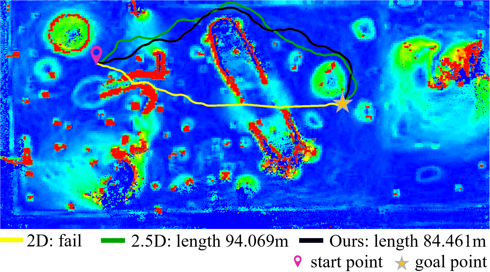
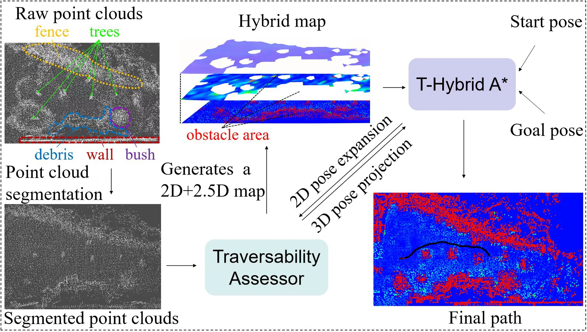

# Hybrid Map-Based Path Planning for Robot Navigation in Unstructured Environments

This repository contains the implementation of our paper:

> **Hybrid Map-Based Path Planning for Robot Navigation in Unstructured Environments** [[pdf](https://arxiv.org/pdf/2303.05304.pdf)]\
> [Jiayang Liu](https://github.com/dwbzxc),  [Xieyuanli Chen](https://github.com/Chen-Xieyuanli), Junhao Xiao,  Sichao Lin,  Zhiqiang Zheng, Huimin Lu

If you use our code in your work, please star our repo and cite our paper.

```
@article{liu2023arxiv,
	title={{Hybrid Map-Based Path Planning for Robot Navigation in Unstructured Environments}},
	author={Liu, Jiayang and Chen, Xieyuanli and Xiao, Junhao and Lin, Sichao and Zheng, Zhiqiang and Lu, Huimin},
	journal={arXiv preprint},
	volume  = {2303.05304},
	year={2023}
}
```

<div align=center>
 
</div>


**Comparison of path planning in a Mars-like surface dataset.** The color map is a hybrid map generated by our terrain assessment. The color represents traversability, which gradually increases from warm to cool colors. The red-colored area represents impassable 2D map areas, and the rest belongs to the 2.5D map. The black path is generated by our method, while the yellow and green paths are from a 2D map-based and a 2.5D map-based baseline methods, respectively. The corresponding path lengths are listed below. As can be seen, our method generates a shorter path across safer areas.

## Overview

<div align=center>
 
</div>


**Overview of our framework.** The framework consists of three main components:

- Segmentation of the raw 3D point clouds.
- Terrain assessment and the hybrid map generation.
- 3D pose projection and T-Hybrid A* path planning.

## Data and benchmark

### Data

The Canadian Planetary Emulation Terrain 3D mapping dataset](http://asrl.utias.utoronto.ca/datasets/3dmap/). 

### How to run

1. **Get the 3D global point clouds:** Note that our terrain assessment starts from the origin of the map, so you may need to translate or rotate the point clouds, and then you need to obtain the entire length and width of the map area that needs to be assessed.  

   There are some tools here:

```
rosrun terrain_analysis cloud_process    ## Tool for transforming the point clouds 
rosrun terrain_analysis find_location    ## Tool for getting the points' location by clicking the mouse. 
```

2. **Terrain assessment:** Once you get the transformed point clouds, please modify the corresponding parameters in `terrain_analysis.cpp`.  Run the following command after compilation:

```
rosrun terrain_analysis terrain_analysis
```

3. **Display the hybrid map:** Layer of static terrain traversability

```
rosrun read_pcd read_pcd
```

4. **Plan the path in the hybrid map:**  Our path planner is inspired by [Kurzer' Hybrid A* algorithm](https://github.com/karlkurzer/path_planner.git), and some improvements are made based on this algorithm. Please modify the corresponding parameters in `constants.h`,  and run the following command after compilation:

```
roslaunch Thybrid_astar path_plan_nubot.launch
```

## Contact

Please contact us with any questions or suggestions!

Jiayang Liu: [jyliu1998@163.com](mailto:jyliu1998@163.com)  and Xieyuanli Chen: xieyuanli.chen@nudt.edu.cn

## License

This project is free software made available under the MIT License. For details see the LICENSE file.